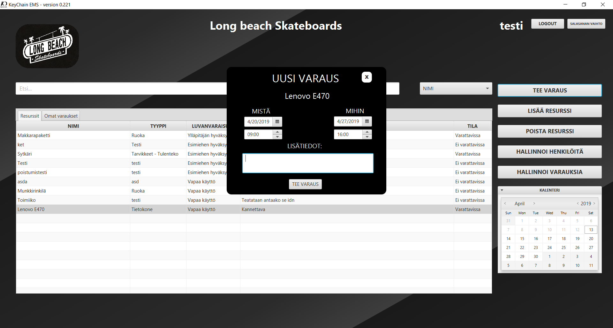
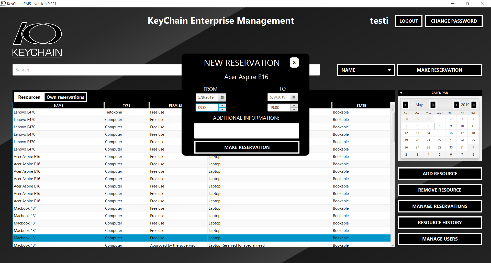
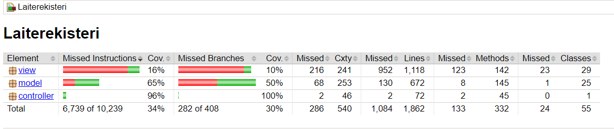

Tietokantayhteyden muodostamiseksi tarvitaan tunneli koneen portista 3306 ryhmämme virtuaalikoneen porttiin 3306. (10.114.32.10:3306).

Komentoriviltä:
 -L 3306:10.114.32.10:3306 tunnus@edunix.metropolia.fi -N

PuTTY:n kautta
PuTTY > SSH > tunnels > Add new forwarded port > Täytä tiedot > Add > Session > Open > Kirjaudu

